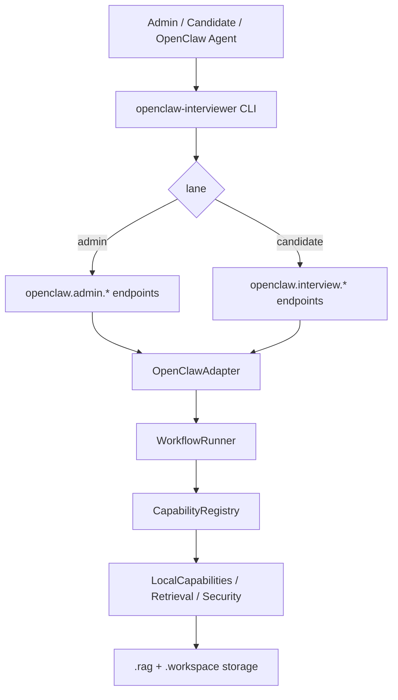
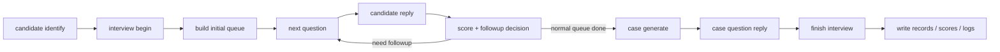
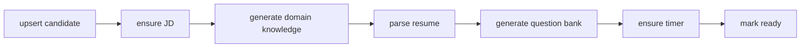

# OpenClaw Interviewer

面向 OpenClaw 的双 lane AI 面试编排 skill。

它不是一个“让模型自己猜下一步”的 prompt 集合，而是一个有明确入口、明确边界、明确工作流、明确落盘产物的工程化项目。

## 1) 项目是什么

`openclaw-interviewer` 用来承接一个完整的 AI 面试场景，分成两条严格隔离的 lane：

- `admin` lane：给管理员/面试运营使用，负责候选人管理、JD 管理、知识库准备、简历解析、题库生成、初始化、排障。
- `candidate` lane：给候选人使用，负责身份核验、面试开始、逐轮问答、追问、案例题、最终收尾。

这个项目解决的核心问题是：

- 让 OpenClaw 知道“现在应该走哪条 lane、调用哪个入口”。
- 让面试流程不依赖临场发挥，而是走固定 workflow。
- 让所有副作用都有结构化落盘，便于复盘、排障和审计。
- 让候选人可见内容与内部评估逻辑彻底分离。

它能做什么：

- 维护候选人列表，支持新增、更新、批量修改、批量删除、刷新。
- 维护 JD 注册表，并为岗位生成领域知识和题库。
- 解析简历，生成候选人画像和候选人题目。
- 初始化候选人，把 JD、简历、题库、timer 等衍生数据补齐到 `ready` 状态。
- 启动真实面试会话，按顺序发题、收回答、评分、决定是否追问。
- 在常规问题后生成综合案例题，并在结束时写入面试记录、评分记录、事件日志、审计日志。

如果命令使用不清楚，先看：

```bash
./setup
openclaw-interviewer doctor
openclaw-interviewer admin candidate-list
openclaw-interviewer interview identify --help
openclaw-interviewer harness --help
```

## 2) 为什么这样设计

这个项目刻意采用“双 lane + 单入口 + 本地落盘”的设计，而不是把所有行为揉成一个大 agent，原因很直接：

- 候选人对话和管理员维护是两种完全不同的权限域，必须隔离。
- 面试过程需要稳定执行，不能靠模型随手猜命令、猜目录、猜状态。
- 面试是可追责流程，需要保留结构化记录，而不是只保留聊天上下文。
- JD、简历、题库、评分、案例题都属于可复用资产，应该沉淀到本地存储层。

设计原则：

- 单一命令入口：统一使用 `openclaw-interviewer ...`
- 单一根目录真相：执行前先确认 skill root
- 双 lane 隔离：`admin` 不能冒充 `candidate`，`candidate` 不能越权访问 `admin`
- workflow 驱动：初始化、开场、轮次、案例、收尾都由 workflow 声明控制
- 可审计副作用：所有关键产物落到 `.rag/` 与 `.workspace/`

## 3) 整体架构

执行路径：



面试主流程：



管理员初始化流程：



## 4) 两条 Lane 的边界

### `admin` lane

负责：

- 候选人列表与生命周期管理
- JD 注册与更新
- 领域知识生成
- 简历解析
- 题库生成
- 检查 retrieval / capability / config 健康度
- harness、doctor、运营排障

允许命令前缀：

- `openclaw-interviewer admin`
- `openclaw-interviewer doctor`
- `openclaw-interviewer harness`
- `./setup` 仅用于首次 bootstrap 或统一入口修复

### `candidate` lane

负责：

- 身份识别
- 面试开始
- 当前状态查看
- 获取下一题
- 提交原始回答
- 生成案例题
- 正常结束面试

允许命令前缀：

- `openclaw-interviewer interview`

### 为什么必须隔离

- 候选人不应该看到评分、审计、知识库、调试信息。
- 管理员操作不能替代真实候选人作答流程。
- 面试中的 `candidate_message` 必须保留原文，不能被 agent 改写、总结或代答。

## 5) 统一入口与 Bootstrap

### skill root 如何识别

只有同时包含以下文件的目录，才是可执行的 skill 根目录：

- `SKILL.md`
- `ENTRYPOINT.json`
- `setup`
- `openclaw-interviewer`
- `config.yaml`

如果当前目录不同时包含这五个文件，就不要在那个目录里直接执行命令。

### 第一次怎么启动

```bash
./setup
openclaw-interviewer doctor
```

`setup` 会做这些事情：

- 使用 `uv venv .venv` 创建项目虚拟环境
- 修复或重建统一入口 `./openclaw-interviewer`
- 创建 `bin/admin`、`bin/interview`、`bin/doctor`、`bin/harness` 兼容入口
- 初始化 `.rag/` 与 `.workspace/` 目录结构
- 同步 `.agent/admin/*.md` 和 `.agent/candidate/*.md` 到 OpenClaw workspace
- 尝试注册两个 OpenClaw agent：
  - `openclaw-interviewer`
  - `openclaw-interviewer-admin`
- 最后自动跑一次 `openclaw-interviewer doctor`

Bootstrap 完成后，后续都统一写成：

```bash
openclaw-interviewer ...
```

不要再手写 Python module 命令，不要猜绝对路径，也不要把 `bin/*` 当成人类主入口。

## 6) 典型使用方式

### 6.1 管理员视角

先看当前候选人和基础健康状态：

```bash
openclaw-interviewer admin capabilities-list
openclaw-interviewer admin retrieval-inspect
openclaw-interviewer admin candidate-list
```

新增一个候选人并自动初始化：

```bash
openclaw-interviewer admin candidate-upsert \
  --candidate-id C2026008 \
  --name 赵六 \
  --role "Python后端工程师" \
  --jd-text "负责 Django 后端开发、接口设计、性能优化。" \
  --resume-file zhaoliu_resume.pdf \
  --scheduled-at 2026-04-06T14:00:00+08:00
```

如果只想维护 JD：

```bash
openclaw-interviewer admin jd-list
openclaw-interviewer admin jd-upsert \
  --jd-role "Python后端工程师" \
  --jd-text "负责 Django 后端开发、接口设计、性能优化。"
```

如果想从自然语言材料中抽取候选人信息：

```bash
openclaw-interviewer admin candidate-add-from-dialog \
  --dialog-file ./candidate_dialog.txt \
  --resume-file zhaoliu_resume.pdf
```

### 6.2 候选人视角

先识别身份：

```bash
openclaw-interviewer interview identify \
  --candidate-name 张三 \
  --candidate-id C2026001
```

开始面试：

```bash
openclaw-interviewer interview begin --session-id <session_id>
```

获取下一题并提交回答：

```bash
openclaw-interviewer interview next --session-id <session_id>
openclaw-interviewer interview reply \
  --session-id <session_id> \
  --candidate-message "这里放候选人的原始回答"
```

收尾：

```bash
openclaw-interviewer interview finish --session-id <session_id>
```

## 7) 核心工作流

项目当前使用 Lobster 风格 workflow 声明文件，由本地 runner 执行：

- `workflows/candidate_init.lobster.yaml`
  - 候选人初始化链，负责知识库、简历 profile、题库、timer、ready 状态
- `workflows/admin_ops.lobster.yaml`
  - 管理员维护链，负责 list、add、bulk update、bulk remove、refresh、inspect
- `workflows/interview_start.lobster.yaml`
  - 身份识别成功后的开场和初始题目队列构建
- `workflows/interview_round.lobster.yaml`
  - 单轮问答、评分、追问决策、切题
- `workflows/interview_case.lobster.yaml`
  - 常规题完成后的综合案例题生成
- `workflows/interview_finalize.lobster.yaml`
  - 最终汇总、记录写入、流程结束

这意味着 README 里看到的“流程图”不是文案包装，而是和仓库里的 workflow 文件一一对应的。

## 8) 主要工具与模块

### 命令工具

- `setup`
  - 项目 bootstrap、修复入口、准备目录、注册 agent
- `openclaw-interviewer`
  - 唯一对外统一命令入口
- `openclaw-interviewer doctor`
  - 健康检查
- `openclaw-interviewer harness`
  - 场景化 smoke / replay / 安全探测

### 内部模块

- `interviewer/api/adapter.py`
  - 将 `openclaw.admin.*` / `openclaw.interview.*` endpoint 分发到 runner
- `interviewer/workflow/runner.py`
  - 核心编排层，组织 workflow、状态推进和副作用写入
- `interviewer/capabilities/`
  - 本地能力集合，包括候选人、JD、简历、题库、评分、案例、retrieval 等
- `interviewer/storage/store.py`
  - 本地结构化存储层，负责 `.rag/` 和 `.workspace/` 的 JSON/JSONL 落盘
- `interviewer/core/`
  - 通信文案、运行时模型、安全策略等基础设施
- `interviewer/harness.py`
  - 场景测试和回放工具

### 配置与入口声明

- `config.yaml`
  - subagent、路径、默认题量、追问次数、时长等配置
- `SKILL.md`
  - OpenClaw-facing 契约
- `ENTRYPOINT.json`
  - 统一入口与 lane 命令边界的机器可读真相文件

## 9) 数据与产物落在哪里

### `.rag/`

主要放“知识和素材资产”：

- `.rag/jd/`
- `.rag/domain/`
- `.rag/domain_question_bank/`
- `.rag/resume/data/`
- `.rag/candidates/`
- `.rag/retrieval/`

### `.workspace/`

主要放“运行时和结果”：

- `.workspace/runtime/`
- `.workspace/interviews/`
- `.workspace/scores/`
- `.workspace/timers/`
- `.workspace/logs/`

换句话说：

- `.rag/` 更像可复用的面试资料层
- `.workspace/` 更像一次次面试运行产生的状态和记录层

## 10) 目录结构

```text
openclaw_interviewer/
├── README.md
├── SKILL.md
├── ENTRYPOINT.json
├── config.yaml
├── setup
├── openclaw-interviewer
├── bin/
├── docs/
├── workflows/
└── interviewer/
    ├── api/
    ├── capabilities/
    ├── config/
    ├── core/
    ├── storage/
    ├── subagents/
    └── workflow/
```

如果从阅读顺序来建议：

1. 先看 `README.md`
2. 再看 `SKILL.md`
3. 然后看 `ENTRYPOINT.json`
4. 接着看 `docs/WORKFLOWS.md` 和 `docs/COMMANDS.md`
5. 最后再读 `interviewer/` 下的实现

## 11) 常用命令速查

### 健康检查 / 调试

```bash
./setup
openclaw-interviewer doctor
openclaw-interviewer harness --scenario admin_ops
openclaw-interviewer harness --scenario full_interview
openclaw-interviewer harness --scenario security_probe
```

### Admin lane

```bash
openclaw-interviewer admin config-show
openclaw-interviewer admin capabilities-list
openclaw-interviewer admin retrieval-inspect
openclaw-interviewer admin jd-list
openclaw-interviewer admin jd-upsert --jd-role "<role>" --jd-text "<jd_text>"
openclaw-interviewer admin candidate-list
openclaw-interviewer admin candidate-upsert ...
openclaw-interviewer admin candidate-add-from-dialog --dialog-file <path> --resume-file <file>
openclaw-interviewer admin candidate-bulk-update --indices 1 2 3 --scheduled-at <iso8601>
openclaw-interviewer admin candidate-bulk-remove --indices 1 2 3
openclaw-interviewer admin candidate-refresh --candidate-id <id>
openclaw-interviewer admin candidate-initialize
```

### Candidate lane

```bash
openclaw-interviewer interview identify ...
openclaw-interviewer interview begin --session-id <session_id>
openclaw-interviewer interview status --session-id <session_id>
openclaw-interviewer interview next --session-id <session_id>
openclaw-interviewer interview reply --session-id <session_id> --candidate-message "<text>"
openclaw-interviewer interview case-generate --session-id <session_id>
openclaw-interviewer interview finish --session-id <session_id>
```

## 12) Admin 输入约束

新增候选人前，管理员必须准备好这些字段：

- `candidate_id`
- `candidate_name`
- `interview_role`
- `jd_id`，或者一整份 `jd_name / jd_role / jd_text`
- `scheduled_at`
- `resume_file` 的真实可读路径

不要做这些事情：

- 不要伪造 JD
- 不要创建空简历或占位简历
- 不要为了补参数，在 skill 目录里临时新建 `*.jd.md`

如果信息不完整，正确做法是继续向管理员追问，而不是“先糊一个能跑的版本”。

## 13) 测试与验证

推荐验证顺序：

```bash
./setup
openclaw-interviewer doctor
openclaw-interviewer admin capabilities-list
openclaw-interviewer admin retrieval-inspect
openclaw-interviewer harness --scenario admin_ops
openclaw-interviewer harness --scenario full_interview
openclaw-interviewer harness --scenario security_probe
```

如果仓库内补齐了 `tests/`，还可以继续跑：

```bash
python3 -m unittest discover -s tests -v
```

Harness 输出一般会包含：

- `traces`
- `step_traces`
- `transcript`
- `final_record`
- `status`
- `errors`

## 14) 相关文档

- [docs/COMMANDS.md](./docs/COMMANDS.md)
- [docs/WORKFLOWS.md](./docs/WORKFLOWS.md)
- [docs/OPERATIONS.md](./docs/OPERATIONS.md)
- [docs/ENDPOINTS.md](./docs/ENDPOINTS.md)
- [docs/ROUTE_BOUNDARIES.md](./docs/ROUTE_BOUNDARIES.md)
- [docs/TESTING.md](./docs/TESTING.md)

## 15) 一句话总结

如果要把这个项目用一句话说清楚：

它是一个给 OpenClaw 使用的、带双 lane 权限边界的 AI 面试执行系统，负责把“候选人管理、知识准备、面试编排、追问评分、案例题、结果落盘”整合到同一个统一入口 `openclaw-interviewer` 之下。
